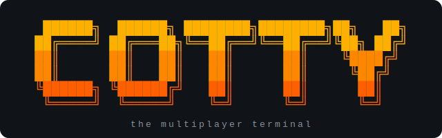

<div align="center">



# Cotty

**The multiplayer terminal.** Your shell, your guests, your rules.

[](go.mod)
[](LICENSE)
[](#install)
[](#end-to-end-encryption)
[](#recording-replay-and-the-audit-trail)

[Install](#install) ·
[Quick start](#quick-start) ·
[Features](#features) ·
[Security](#end-to-end-encryption) ·
[How it works](#how-it-works) ·
[Contributing](#contributing)

</div>

---

Cotty (*collaborative + tty*) is a multiplayer terminal: host your shell,
let teammates join over the network, watch together — and, when you allow
it, type together. It targets the gap between screen-sharing hacks
(`tmate`, `sshx`, "look at my Zoom") and what real-time collaboration
should feel like in a terminal: first-class sessions with per-guest
permissions, presence, accountability, and end-to-end encryption.

## Features

- **Host anywhere** — `cotty host` spawns your shell in a PTY and serves
  it over a websocket; your local terminal stays attached as usual
- **Join from any terminal** — `cotty join -name alice` mirrors the
  session, with a display name everyone sees
- **Join from a browser** — every relay and locally hosted session serves
  an embedded xterm.js client; no install needed for guests
- **NAT-friendly relay** — `cotty relay` + `cotty host --relay <server>`:
  the host dials *out*, so no port forwarding on either side
- **Per-guest permissions** — guests are view-only by default; grant,
  revoke, and kick live: `cotty ctl allow alice`, `deny`, `kick`, `list`
- **End-to-end encrypted by default** — relayed sessions use
  AES-256-GCM; the relay forwards ciphertext it cannot read
- **Recording & replay** — `-record session.cast` writes asciicast v2,
  playable with `cotty replay` or asciinema
- **Audit trail** — `-audit trail.jsonl` logs who typed what: every
  applied keystroke attributed by participant, plus joins, leaves,
  permission changes, and kicks
- **Live presence** — everyone sees who joins, leaves, and is typing
- **Session codes** — every session is protected by a random join code

## Install

```sh
go install github.com/tylerbroqs/cotty/cmd/cotty@latest
```

Or build from source:

```sh
git clone https://github.com/tylerbroqs/cotty
cd cotty
go build -o cotty ./cmd/cotty
```

Requires Go 1.24+. Linux and macOS; Windows guests should work (`join`
uses no PTY), Windows hosting is untracked for now.

## Quick start

```sh
# On the host machine
cotty host            # view-only guests
cotty host --write    # guests can type too

# Cotty prints something like:
#   cotty: session code XJ4K2P
#   cotty: guests join with: cotty join ws://<this-host>:7373/ws?code=XJ4K2P

# On a guest machine
cotty join -name alice "ws://192.168.1.10:7373/ws?code=XJ4K2P"
```

Guests press `Ctrl-]` to leave. The session ends when the host's shell
exits.

### Managing guests

Guests join view-only under the name they picked (`-name`, defaulting to
`$USER`). The host manages them live from any other terminal on the host
machine — or straight from inside the hosted shell, since every session
exports `$COTTY_SESSION`:

```sh
cotty ctl list          # who's here, and who can type
cotty ctl allow alice   # let alice type
cotty ctl deny alice    # back to view-only
cotty ctl kick bob      # disconnect bob
```

Starting with `--write` makes new guests writable by default instead.
Everyone gets join/leave notices, and permission changes are announced to
the affected guest.

### Recording, replay, and the audit trail

```sh
# record the session and keep a "who did what" trail
cotty host -record pairing.cast -audit pairing.jsonl

# play it back later (2x speed, long pauses capped at 2s by default)
cotty replay -speed 2 pairing.cast
```

Recordings are standard asciicast v2, so asciinema and its web player
work too. The audit trail is JSON lines: every keystroke that reached the
shell, attributed to the participant who typed it (the host included, and
guests are attributed correctly through a relay), plus joins, leaves,
permission grants, and kicks. Input that was rejected — a view-only guest
typing — never reaches the shell and is deliberately absent: the trail
records what actually ran.

### Across networks: hosting through a relay

Direct hosting requires guests to reach your machine. When you're behind
NAT (home network, office, coffee shop), run a relay on any machine with a
public address and host through it — the host connects *outward*, so no
port forwarding is needed on either side:

```sh
# On a public server
cotty relay -addr :7374
# behind TLS? tell it the public base URL guests should use:
cotty relay -addr :7374 -public-url wss://relay.example.com

# On your machine (anywhere)
cotty host --relay relay.example.com:7374
# prints: cotty join "ws://relay.example.com:7374/ws?code=XJ4K2P"

# Guests, from anywhere
cotty join "ws://relay.example.com:7374/ws?code=XJ4K2P"
```

The relay forwards frames and enforces the session's read-only setting;
the host additionally enforces it locally.

### End-to-end encryption

Relayed sessions are encrypted end-to-end by default. The host generates
a 256-bit session key and puts it in the join URL's *fragment*:

```
cotty join "ws://relay.example.com:7374/ws?code=XJ4K2P#k=8D0Uy-5ugL..."
                                                      └── never sent over
                                                          the network
```

URL fragments are stripped by clients before any request is made, so
guests receive the key from the host (through however the URL was shared)
while the relay never sees it. Terminal output and guest input are sealed
with AES-256-GCM; a guest joining without the key is refused with an
explanation, and a wrong key fails loudly rather than showing garbage.
Opt out with `cotty host --relay ... -plain`.

What the relay can still see: guest names, join/leave events, the session
code, terminal size, and traffic timing/volume. Share the join URL over a
channel you trust — anyone with the full URL has the key.

### Joining from a browser

The host prints a browser link next to the CLI one:

```
cotty: guests join with: cotty join "ws://relay:7374/ws?code=XJ4K2P#k=..."
cotty: or in a browser: http://relay:7374/join#code=XJ4K2P&k=...
```

The page is an xterm.js terminal served by the relay (or by the host
itself for local sessions) speaking the same websocket protocol as the
CLI client. Encryption and decryption happen in the page via WebCrypto;
the session code and key live in the URL fragment, which browsers never
send to any server. Assets are embedded in the cotty binary — the page
makes no CDN or third-party requests. Opening the bare page (no fragment)
shows a join form instead.

## How it works

```
host terminal ──┐
                ├── PTY (your shell)
guest ws ───────┤        │
guest ws ───────┘        ▼
                 output fan-out to local stdout + all guests
```

The host process owns the PTY. Local keystrokes and (if `--write`) guest
keystrokes are written to it; everything the PTY emits is fanned out to the
local terminal and every connected guest. Frames are JSON over websocket —
see [`internal/protocol`](internal/protocol/protocol.go). v0 is
deliberately debuggable; a binary protocol comes later.

With a relay, the fan-out moves server-side — the host holds one outbound
connection and the relay maintains the guest hub:

```
host terminal ── PTY ── ws (outbound) ──► relay ──► guest ws
                                            │ ────► guest ws
```

## Contributing

Issues and pull requests are welcome. Keep changes small and focused, and
make sure the tree stays clean before sending a PR:

```sh
go vet ./...
go build ./...
```

The codebase is deliberately compact — a handful of small packages under
[`internal/`](internal/), no framework, minimal dependencies. Please keep
it that way.

## License

MIT — see [LICENSE](LICENSE).
